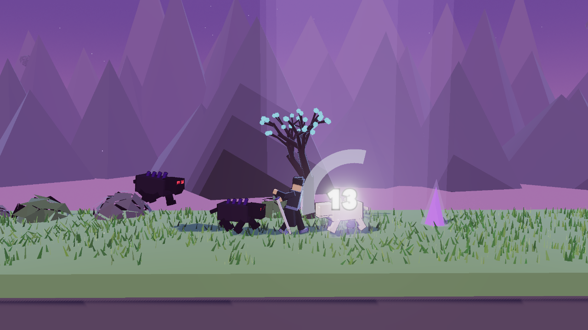
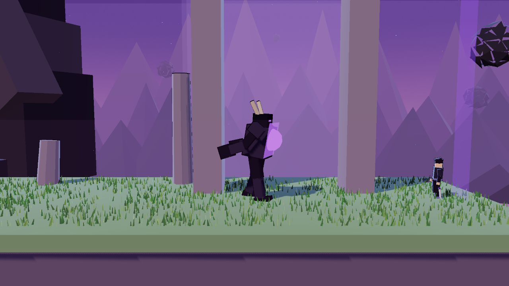

# SOMBRA

A 2.5D hack & slash in the Korean *hunter-and-gate* LitRPG tradition — one
hunter, one D-rank gate, and a boss at the end of it. Devil May Cry's combat
vocabulary (combo chains, cancel windows, launchers, air juggles, a style
meter) on Prince of Persia's side-on traversal, rendered in the soft cel-shaded
palette of a stylised open-world Pokémon game.

Named moves are drawn from across the Romance languages — *Sombra* (shadow),
*Décret* (decree), *Ascensão* (ascension) — because a magic system reads better
when its vocabulary comes from somewhere other than English.

It runs in a browser with **no build step and no dependencies to install**.
three.js is vendored into the repo; everything else — every model, animation,
sound and particle — is generated in code at startup. There is not a single
asset file.



## Run it

```bash
python3 tools/serve.py
```

Then open <http://localhost:8000>. It must be served over HTTP rather than
opened as a `file://` URL, because the game is a set of ES modules resolved
through an import map.

Use that script rather than `python3 -m http.server`. `http.server` sends
`Last-Modified` and no `Cache-Control`, so the browser falls back to heuristic
freshness and serves stale modules and CSS without asking — an edit appears to
have had no effect, and you go and change something that was never wrong. It has
cost this project two wrong diagnoses and, most likely, a whole round of
playtest verdicts. `tools/serve.py` is `http.server` with `no-store` on every
response.

## Controls

| Action | Keys |
| --- | --- |
| Move | `A` / `D` or arrows |
| Jump — press again in mid-air to **double jump** | `Space` |
| **Shadow Step** — dash, with invincibility frames | `Shift` |
| **Shadow Slash** — three-hit chain | `J` or `Z` |
| **Ascensão** — launcher on the ground, **Shadow Descent** dive in the air | `K` or `X` |
| **Décret** — piercing bolt, 16 MP | `L` or `C` |
| **SORGI** — raise a shadow from a body, 0.8 s immobile | hold `S`, press `K` |
| Pause | `Esc` |

## The fight

The light chain is three swings — two fast, then a heavy finisher — and each
one **lunges you forward**, because an attack that leaves you rooted reads as
slow no matter how quickly the animation plays. Press again during recovery to
cancel into the next hit; the cancel window always sits inside recovery and
never inside the active frames, so a chain feels responsive without one input
producing two hitboxes.

The launcher pops an enemy into the air and can be **jump-cancelled**, which is
the whole reason it exists: `K` to launch, `Space` to chase it up, then `J`.
There is a 0.40-second window to land that swing, and a second `J` extends the
juggle rather than being required by it. Air attacks suppress gravity for a few
frames so a juggle stays airborne — capped at two per airtime, or mashing attack
would just be a slow-fall button and every pit in the level would become
optional. Swinging never takes the controls away from you: a running jump keeps
all of its speed through a swing, and you can still steer during one.

The style meter rewards **variety**, not volume: repeating a move scores a
fraction of its value, and taking a hit costs you more than half the meter.

### SORGI

Kill a shadow beast and its body stays for about four seconds, marked by a
violet shard that shrinks as the window closes — the timer is the shard, not a
number in a corner. Stand over it, hold `S` and press `K`, and the hunter roots
in place for a short channel. Take a hit during it and the channel breaks. Let
it finish and the beast rises in your colours, follows you, and pounces on
whatever you are fighting.

You get **one**. Extracting again replaces it, it has its own health, and when
it dies your only route to another is another body. It follows you out of the
encounter and into the boss arena — which contains no other enemies and so no
corpses, making the bridge ambush a real choice: spend the shadow to survive it,
or protect it for the Guardian.

The price is never mana. It is standing still in a live fight, which is a gamble
against the same tells everything else in the game is built on. Its kills give
you EXP so the ally never reads as a punishment, and no style — and since style
drives mana regeneration, leaning on it quietly costs you rank.

### One rule for every enemy

**Nothing has passive contact damage.** Touching a shadow beast, a wisp or the
Gate Guardian is completely safe. Every point of damage in the game comes from
a committed action with a visible tell — the beast crouches and its eyes flare,
the Guardian plants its feet and the core in its chest ignites.

This is not politeness, it is the only way the fight works. Your own attacks
lunge you into the enemy, so contact damage makes the correct play "never
attack" — and against a boss three times your width it makes melee a losing
proposition outright. It also makes losing legible: you lost because you missed
the tell, not because you brushed against something.



## The gate

One level, **Hollow of the Kneeling Stone**, named for the colossus knelt
behind the arena at the end of it.

1. **The approach** — no enemies. Room to find out what the buttons do.
2. **First blood** — three shadow beasts in a sealed bowl.
3. **The climb** — three committed jumps up a broken stair.
4. **The chasm** — islands over the void, patrolled by wisps that hold their
   distance and shoot.
5. **The bridge** — six enemies, arriving over seven seconds rather than all at
   once. The count is the spectacle; the spacing is the difficulty.
6. **The Gate Guardian** — 900 HP, four telegraphed attacks, and a second phase
   below half health.

Levelling up restores you to full and is the **only** heal in the game, which
makes the EXP curve a difficulty control rather than a reward schedule — it is
tuned so a level-up lands partway into the ambush, the one fight long enough to
run a health bar dry.

## Verification

Open <http://localhost:8000/?sim> to run the scripted suite. It steps the
simulation directly and drives the real input layer, so the bots play through
exactly the code path a human does — same buffering, same cancel windows, same
collision. `Math.random` is replaced with a seeded generator for the duration,
because two runs of the same build were otherwise disagreeing about whether the
level was completable.

This is not optional tooling. Browsers throttle `requestAnimationFrame` in an
unfocused tab, so any automated playtest that waits on wall-clock time advances
the simulation by a fraction of a second and silently measures nothing.

Every test runs in **its own seed scope**, and the playthrough runs **eight
seeds** rather than one. Both of those were bought the hard way. The suite used
to run a single sequential stream, so a change that made the playthrough two
seconds longer consumed a different number of draws and silently re-rolled every
boss fight after it — numbers moved for two reasons at once and there was no way
to tell which. And a single playthrough sample was never evidence about the
level; it was evidence about a seed.

Current results:

| | |
| --- | --- |
| Jump envelope | **3.36** units high, **6.08** across at a run — 5.8 and 9.76 with the double jump |
| Gaps | widest is 3.8 (needs 4.5 of the 6.08); every one clearable on a single jump |
| Move list | all six attacks connect for their advertised damage |
| Air attack | a running jump keeps **100%** of top speed through a swing, and the direction key still commands 1.9 units of travel during one |
| Launcher juggle | `K` → `Space` → `J` connects across a **0.40 s** window; the launched enemy rises 5.39 against a 6.59 jump |
| Playthrough | the telegraph-reading bot clears **8/8** seeds, average 58 s |
| Gate Guardian | mash and dodge both win with ~100 HP left |

For the boss, melee has to be a winning answer and mana must not be — the
`ranged` bot is a balance probe, and if it ever starts winning comfortably the
bolt is overtuned. **It currently wins**, on six of eight seeds, which is a real
signal and is recorded here rather than quietly tuned away.

One claim that used to live here has been **withdrawn**. The suite reported that
a bot ignoring telegraphs died at the ambush, and that pair — reader clears,
naive dies — was cited as the combat design stated as a test. It was an
artifact. Both bots were hitting a navigation deadlock at a sealed arena
barrier, and the dodging bot merely jittered out of it more often; with the
deadlock fixed both clear every seed taking the same damage. Dashing on a
telegraph currently buys the bot nothing.

That is a statement about the evidence, not the game. A human playtest confirmed
separately that the beast's tell reads, that 0.42 s is enough to react to, and
that it is learnable. What died is the automated proof, not the design — and the
fix is not to make the naive bot worse until the old answer comes back.

Six real bugs came out of writing the suite. Two more came out of the round-2
playtest: air attacks were ignoring the direction key outright, and a launched
enemy's upward velocity was being *assigned* rather than floored, so the aerial
that was supposed to extend a juggle was the hit that ended it.

### Frame times

Open <http://localhost:8000/?perf> in a **real browser window** and play. It
records every frame and, for each one over 28 ms, names what the game did in the
250 ms before it — an encounter firing, an enemy spawning, a System window
opening. It must not be run in an embedded or backgrounded view, where rAF
throttling makes frame timing meaningless.

Those bugs included enemies being teleported onto the tops of arena barriers
(the collision solver ignored penetration when velocity was zero), wisps
following the player down into the void, and attack lunges walking you off
ledges while the swing rooted your steering. The commit history has the details.

## How it looks

- **Cel shading** from a four-band gradient map on `MeshToonMaterial`.
  `NearestFilter` is load-bearing — any filtering reintroduces the gradient the
  banding exists to destroy.
- **Rim light** injected into the toon shader through `onBeforeCompile`. Cel
  shading alone flattens a silhouette against a dark background.
- **Ink outlines** from an inverted hull expanded along each vertex's *radial*
  direction rather than its normal. Box geometry has hard face normals, so a
  normal-expanded hull tears open at every corner.
- **Faceted rock** from non-indexed geometry with recomputed normals, since
  `MeshToonMaterial` has no `flatShading` flag — and baking facets into the
  geometry is cheaper anyway.
- **~17,000 grass blades** in one `InstancedMesh`, bent by a wind function in
  the vertex shader and scattered in clumps rather than uniformly, because
  uniform scatter reads as a texture swatch.
- **A three-stop sky gradient** with fog matched to the horizon, so distance
  dissolves into the sky instead of clipping to black.

All scenery sits at negative Z. The camera is at +Z, so a prop in front of the
play plane is a prop that hides the fight.

## Layout

```
index.html            import map, DOM overlay, the System's windows
src/
  main.js             boot and screen flow
  engine/
    loop.js           fixed 120 Hz simulation, decoupled rendering
    input.js          key state with a 160 ms press buffer
    audio.js          every sound, synthesised in the Web Audio graph
    mathx.js          clamp, damp, easing, value noise
  render/
    world.js          renderer, sky, lighting, bloom
    toon.js           gradient maps, rim light, inverted-hull outlines
    models.js         every character, built from boxes
    env.js            grass, rocks, spirit trees, mist, parallax ridges
    vfx.js            sparks, slash arcs, shockwaves, damage numbers
    palette.js        every colour
  game/
    game.js           combat resolution, encounters, progression
    player.js         movement, the move list, rig animation
    enemies.js        shadow beasts, wisps, projectiles
    shadow.js         SORGI: claimable corpses and the raised ally
    boss.js           the Gate Guardian
    level.js          the gate: geometry, collision, encounter data
    camera.js         2.5D chase camera with trauma-based shake
    actor.js          shared AABB physics
    config.js         every tunable number
  ui/
    hud.js, style.css the System's interface
tools/
  sim.js              the scripted verification suite
  perf.js             frame-time recorder — ?perf, real browser only
  serve.py            static server with caching switched off
vendor/three/         three.js v0.185.1, pinned
```

Physics runs at a fixed 120 Hz because combat is built on frame-counted windows
— active frames, cancel windows, i-frames — and those stop being tunable the
moment the step length varies. Every number that affects gameplay lives in
`src/game/config.js`; nothing gameplay-affecting is hard-coded anywhere else.

## Licence

MIT for the game code. three.js is vendored under `vendor/` and carries its own
MIT licence.
